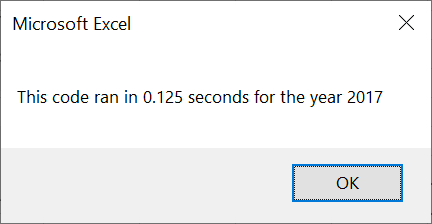

# Stock Analysis with VBA

## Overview of Project 
Upward mobility is the emblem of the American dream. In recent years, the stock market has become a lucrative avenue for both rookies and veterans who hope to increase their wealth. Stock analysis is a vital part of investment planning as changes in the volume traded and yearly return can inform one of future stock performance. The purpose of this project was to create VBA macros that looped through each row of data to calculate the total volume and return percentage of each ticker for a given year. Essential elements of the code include for loops, if-then statements, arrays, and conditional formatting for visual cues.

## Results
The yearly returns for 2017 suggest a bull market with only one ticker registering a negative return. 2018 was quite the opposite with only two tickers registering a positive return. SPWR and ENPH had the largest trading volumes for 2017 and 2018, respectively. The initial code to run the all stocks analysis `Sub AllStocksAnalysis ()` had a run time of more than one second for each year. The refactored code takes 0.125 seconds to run once one inputs the desired year as shown in the images below:

## Summary
Refactoring code is a double edged sword. On one hand, it allows for greater efficiency and faster run times as the code becomes more condensed. On the other hand, it is a time consuming process that requires a great deal of creativity and research. One has to weigh whether the promised efficiency is worth the initial capital it requires to refactor the code. An important consideration is the legibility of a code. This can come into play when things break and support is needed. A more rudamentary line of code may be long but it can be a more informative way of understanding the intended task. A concise line of code provides a more linear route to the end task but may require alot of inference. 

A disadvantage of the original code is the presence of a nested for loop. This is resolved in the refactored code with two separate loops. This change was preferred because it made it easier to debug the code as I knew which loop was not working. Initially, the introduction of `tickerIndex` proved a bit confusing as the purpose of the iterator in the for loop was blurred. This was resolved upon the realization that `tickerIndex` was being used to access the stock ticker index for `tickers`, `tickerVolumes`, `tickerStartPrices`, and `tickerEndPrices`.
